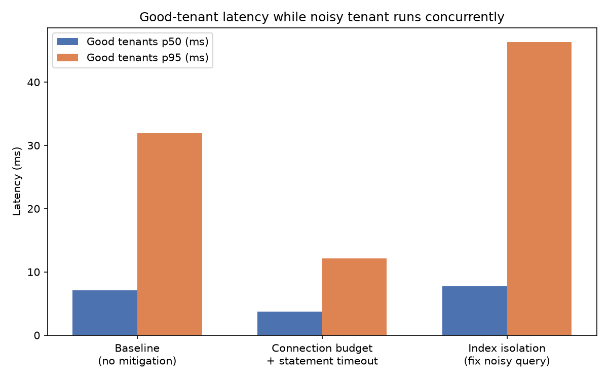

# Noisy Neighbor Simulator

A small experiment measuring how one tenant's badly-written query degrades
query latency for every other tenant sharing the same Postgres instance —
and testing three different mitigations empirically, rather than assuming
any of them work.

## The setup

Six tenants share one Postgres database and the same tables
(`tenants`, `products`, `orders`, `order_items`), distinguished only by a
`tenant_id` column. This is the "pooled" multi-tenancy model many SaaS
systems use because it's cheap to run — but it means tenants share buffer
cache, disk I/O, CPU, and lock contention.

- **5 good tenants** run a simple, well-indexed hot-path query (a
  customer's 20 most recent orders).
- **1 noisy tenant** owns 80,000 orders / ~320,000 order line items (vs.
  5,000 orders / ~15,000 items for each good tenant — genuinely proportional
  to being a bigger customer, not an artificial outlier) and runs a
  category-aggregation query joining `order_items → orders → products`
  with no supporting index on the join/filter columns.

All six run concurrently for 8 seconds per scenario, and I measure the
good tenants' combined latency distribution while the noisy tenant hammers
the shared instance.

## Three scenarios, tested empirically

| # | Scenario | What it does |
|---|---|---|
| 1 | **Baseline** | No mitigation. Noisy tenant runs freely. |
| 2 | **Connection budget + statement timeout** | Noisy tenant capped at 2 concurrent connections; every query gets a 2s server-side `statement_timeout`. |
| 3 | **Index isolation** | Add the "obviously missing" indexes on `order_items(tenant_id, order_id)` and `order_items(product_id)` — the fix most people would reach for first. |

## Results



| Scenario | Good tenants p50 | Good tenants p95 | Noisy tenant p50 |
|---|---|---|---|
| Baseline | 11.6 ms | 22.2 ms | 843.7 ms |
| Connection budget + timeout | **5.2 ms** | **12.3 ms** | 584.2 ms (2 rejected) |
| Index isolation | 13.6 ms | 25.3 ms | 786.5 ms |

Full raw numbers: [`results/results.json`](results/results.json).

### The finding I didn't expect

My working hypothesis going in was that adding the missing index would be
the real fix, and the connection/timeout limits were just a stopgap. The
data says the opposite for this workload:

- **The index barely helped the noisy tenant's own query** (843ms → 786ms,
  ~7%) and **did nothing for the good tenants** (11.6ms → 13.6ms, within
  noise).
- **The connection budget + timeout mitigation was the one that actually
  protected the good tenants** — their p50 latency roughly halved.

I checked `EXPLAIN ANALYZE` on the noisy query after adding the index to
understand why:

```
Parallel Seq Scan on order_items oi (actual time=1.577..23.238 rows=160000 loops=2)
  Filter: (tenant_id = 6)
  Rows Removed by Filter: 37500
```

Postgres's planner **ignored the new index and chose a sequential scan
anyway** — correctly. The noisy tenant owns roughly 80% of the shared
`order_items` table, so a `tenant_id` index has almost no selectivity: an
index scan would mean ~160,000 random row lookups, which is slower than
one sequential pass. **Indexing only helps when a tenant is a minority of
a shared table.** Once one tenant's data dominates it, the real fix is
architectural — partitioning by tenant, or moving that tenant to isolated
storage — not a `CREATE INDEX` statement.

This is the actual thesis of this project: **don't trust that the
"obvious" fix worked — measure it.** An index isolation fix looks correct
on paper (it removes a real missing-index code smell) and still doesn't
move the metric that matters, because the bottleneck was resource
contention, not this table lacking this index.

## What each mitigation is actually good for

- **Connection budget + statement timeout** — protects other tenants
  *right now*, without touching the noisy tenant's code or schema. Good
  as an emergency lever, or when the noisy query is ad-hoc/tenant-authored
  and you can't fix it directly. Cost: the noisy tenant's own requests get
  slower or rejected (2 of 30 were rejected in this run) — you're
  containing the blast radius, not fixing the underlying query.
- **Index isolation** — the right fix in general, but only when the
  problem is genuinely a missing index for a *minority-share* access
  pattern. It does not help when the query's cost comes from touching a
  large fraction of a shared table regardless of index use — that's a
  data-distribution problem, not a missing-index problem.

## Architecture

- `noisy_neighbor/workload.py` — `Tenant` and `Workload` (ABC), with
  `GoodTenantWorkload` and `NoisyTenantWorkload` subclasses. Splitting
  "who" from "what traffic they run" keeps the simulator able to mix and
  match workloads without tenant-specific branching elsewhere.
- `noisy_neighbor/db.py` — connection handling plus `ConnectionBudget`, a
  per-tenant semaphore that caps concurrent connections.
- `noisy_neighbor/simulator.py` — runs every tenant's workload
  concurrently in threads for a fixed duration and collects latency
  samples per tenant.
- `noisy_neighbor/metrics.py` — percentile/summary stats. Timed-out or
  budget-rejected requests are kept as `inf` in the distribution rather
  than dropped, since a rejected request is a real outcome from the
  caller's point of view.
- `benchmark.py` — orchestrates the three scenarios and writes
  `results/results.json`.
- `seed.py` — generates realistic synthetic data with `Faker`, seeded
  deterministically.

## Running it yourself

```bash
# 1. Start Postgres
docker compose up -d

# 2. Install dependencies
pip install -r requirements.txt

# 3. Seed the database (idempotent — re-running re-creates the schema)
python3 seed.py

# 4. Run the benchmark (takes ~30s)
python3 benchmark.py

# 5. Generate the chart
python3 plot_results.py

# 6. Run the unit tests
pytest tests/ -v
```

## AI use

See [`AI_USE.md`](AI_USE.md) for what AI tools were used for in building
this, and a specific case of AI-generated output that turned out to be
wrong and how I caught it.
